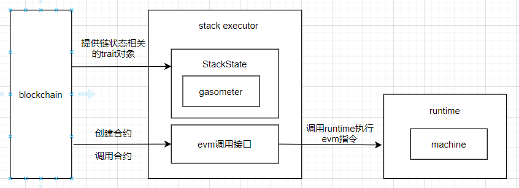

executor是整个rust-evm项目中比较重要的部分，外部创建合约、调用合约接口都是通过executor完成。其它的组件如gasometer、evm、runtime都由此executor来调度。

# 1 数据结构
## Accessed 
1、定义：
```
pub struct Accessed {
	pub accessed_addresses: BTreeSet<H160>,
	pub accessed_storage: BTreeSet<(H160, H256)>,
}
```
2、功能描述：
主要记录一组H160账户，用于做栈访问存储的管理。

这个数据结构主要和EIP2930有关，EIP2930提出一个新的交易类型，让交易中多带一个access list，即所有这笔交易即将读写的storage slot，并且先帮忙付掉第一次读写的gas，而真正交易读写该storage时，只会被要求付100 gas。

## StackSubstateMetadata
1、定义：
```
pub struct StackSubstateMetadata<'config> {
	gasometer: Gasometer<'config>,
	is_static: bool,
	depth: Option<usize>,
	accessed: Option<Accessed>,
}
```
2、功能描述：
记录栈操作时对应的元数据，主要包括：
* gasometer，记录gas使用的具体情况；
* depth，栈的深度；
* accessed，栈访问的存储。

## StackExecutor

1、定义：
```
pub struct StackExecutor<'config, 'precompiles, S, P> {
	config: &'config Config,
	state: S,
	precompile_set: &'precompiles P,
}
```
三个字段的意义分别如下：
* Congfig字段是对应的evm的配置，集成的时候可以根据链的需求设置不同的配置；
* state是能提供链（要继承该evm的链）的相关状态，是一个trait对象，实现了StackState trait；
* precompile_set是预编译合约的集合。

2、功能描述：
StackExecutor是真正用来执行动作的执行器。

## StackExecutorHandle
1、定义：
```
struct StackExecutorHandle<'inner, 'config, 'precompiles, S, P> {
	executor: &'inner mut StackExecutor<'config, 'precompiles, S, P>,
	code_address: H160,
	input: &'inner [u8],
	gas_limit: Option<u64>,
	context: &'inner Context,
	is_static: bool,
}
```

2、功能描述：
StackExecutorHandle主要用来记录合约执行的中间过程。

# 2 执行过程
上面的最重要的数据结构就是StackExecutor，它也是执行evm合约调用的主体。executor和runtime以及gasometer的关系如下图：



重点补充下transact_create\transact_create2\transact_call的调用图，指令的执行主要是runtime，和gasometer的关系要说清楚

