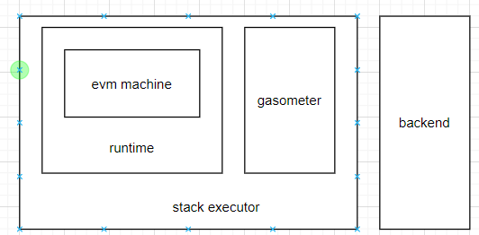

rust-evm主要由几大部分组成，分别如下：
- machine：执行指令的具体的虚拟机实体，起
- runtime：runtime；
- gasometer：记录合约在evm执行过程中的gas使用情况的实体；
- stack executor：提供合约创建和合约调用相关的接口，由链上调用；当有合约创建或者是调用时，在处理函数中创建下面的gasometer和runtime对象，然后完成evm执行的操作。

整体的架构图如下：

